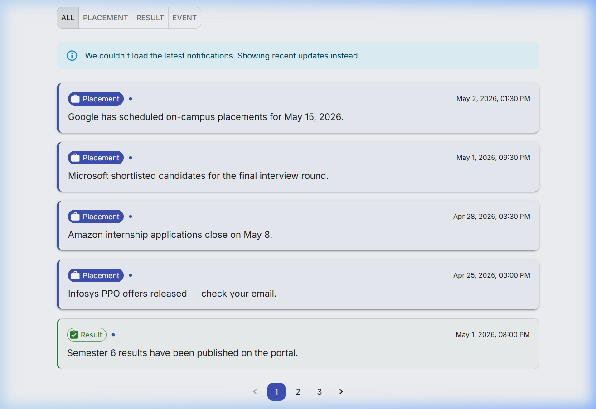
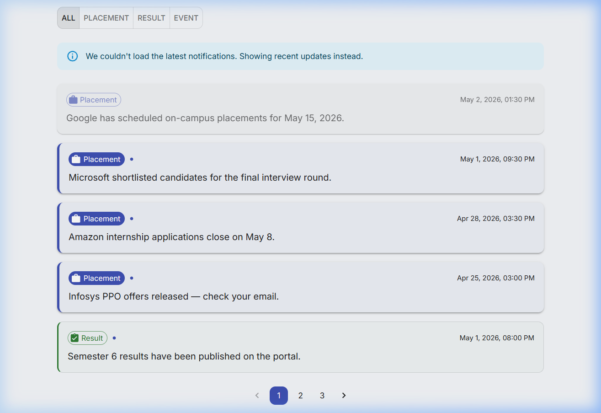
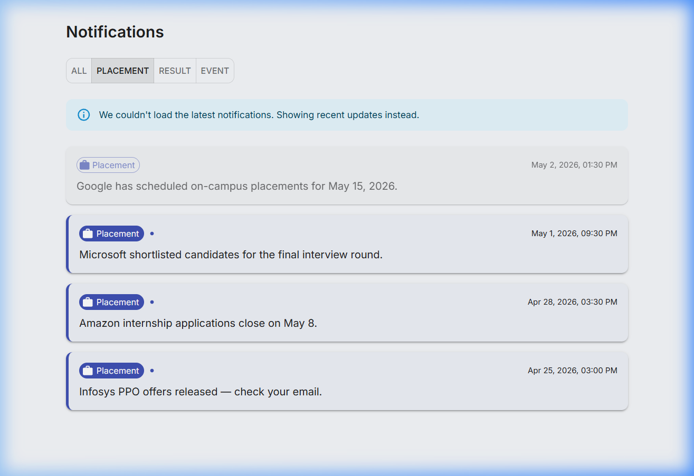

# Stage 1

# Notification System — Design Document

## 1. Problem Statement

Build a notification dashboard that fetches notifications from an API, sorts them by priority and recency, supports filtering and pagination, and maintains the **top 10 most relevant notifications** efficiently — even as new notifications keep arriving.

---

## 2. Architecture Overview

```
API (or Mock Fallback)
        │
        ▼
┌──────────────────────────┐
│   notificationService.ts │  ← fetch, parse, normalize
│   (Service Layer)        │  ← structured logging on every lifecycle event
└──────────┬───────────────┘
           │
           ▼
┌──────────────────────────┐
│   useNotifications.ts    │  ← state orchestration, sorting, filtering, pagination
│   (Hook Layer)           │  ← fallback logic, read/unread state, logging
└──────────┬───────────────┘
           │
           ▼
┌──────────────────────────┐
│   NotificationsPage.tsx  │  ← layout, conditional rendering, scroll reset
│   NotificationCard.tsx   │  ← priority-based visual hierarchy, read/unread UI
│   (UI Layer)             │
└──────────────────────────┘
           │
           ▼
┌──────────────────────────┐
│   logger.ts              │  ← centralized structured logging middleware
│   (Cross-Cutting)        │
└──────────────────────────┘
```

### File Structure

```
src/
├── types/notification.ts            # RawNotification + Notification + filter types
├── services/notificationService.ts  # Fetch, parse, normalize API data
├── utils/
│   ├── sortNotifications.ts         # Sort by type priority + timestamp
│   └── formatTimestamp.ts           # Date → human-readable string
├── mocks/notifications.ts           # Fallback mock data (Date objects)
├── logging_middleware/logger.ts     # Structured logging middleware
├── hooks/useNotifications.ts        # State orchestration + API integration
├── components/NotificationCard.tsx  # Reusable card (memoized, read/unread)
└── pages/NotificationsPage.tsx      # Page with filter + pagination + layout
```

---

## 3. Maintaining the Top 10 Efficiently

### The Challenge

Notifications keep arriving. The user should always see the **top 10 most relevant** items based on:

1. **Type priority**: Placement > Result > Event
2. **Recency**: Within the same priority, newer items appear first

Naively re-sorting the entire list on every new notification is O(n log n). As the dataset grows, this becomes expensive.

### Current Implementation (Small Dataset — Client-Side)

For the current scale (~12–50 notifications), the approach is straightforward:

```typescript
const TYPE_PRIORITY: Record<NotificationType, number> = {
  placement: 0,  // highest priority
  result: 1,
  event: 2,      // lowest priority
};

export function sortNotifications(notifications: Notification[]): Notification[] {
  return [...notifications].sort((a, b) => {
    const priorityDiff = TYPE_PRIORITY[a.type] - TYPE_PRIORITY[b.type];
    if (priorityDiff !== 0) return priorityDiff;
    return b.timestamp.getTime() - a.timestamp.getTime(); // newest first
  });
}
```

This works because:
- The dataset is small enough that O(n log n) is negligible
- Sorting happens inside `useMemo` — only re-computed when the `allNotifications` array reference changes
- The sorted result is then paginated (sliced to 5 items per page), so the UI only renders what's visible

### Scaling Strategy — How to Maintain Top 10 as New Notifications Arrive

If the system scales to thousands of notifications arriving in real-time, the approach shifts to **insertion-based maintenance** instead of full re-sorts:

#### Strategy: Bounded Min-Heap (O(log k) per insertion)

```
Concept:
- Maintain a min-heap of size k (k = 10 for top-10)
- The heap is ordered by (priority, timestamp) — lowest-priority/oldest item sits at the root
- When a new notification arrives:
  1. If heap.size < k → insert directly (O(log k))
  2. If new item ranks higher than the root → remove root, insert new item (O(log k))
  3. Otherwise → discard the new item (O(1))
```

**Why this works for top-10:**

| Operation | Full Re-Sort | Min-Heap |
|-----------|-------------|----------|
| Insert 1 new item | O(n log n) | O(log 10) = O(1) |
| Insert batch of m items | O((n+m) log(n+m)) | O(m × log 10) = O(m) |
| Memory | O(n) full list | O(10) heap + O(n) raw storage |

#### Practical Implementation (Frontend)

In a React frontend, the heap can be simplified to a sorted array of size 10 with binary insertion:

```typescript
function insertIntoTop10(
  top10: Notification[],
  incoming: Notification
): Notification[] {
  const rank = (n: Notification) =>
    TYPE_PRIORITY[n.type] * 1e15 + (Number.MAX_SAFE_INTEGER - n.timestamp.getTime());

  const incomingRank = rank(incoming);

  // If top10 is not full, just insert and sort
  if (top10.length < 10) {
    return [...top10, incoming].sort((a, b) => rank(a) - rank(b));
  }

  // If incoming doesn't outrank the weakest item, skip
  const weakestRank = rank(top10[top10.length - 1]);
  if (incomingRank >= weakestRank) return top10;

  // Binary search for insertion point
  let lo = 0, hi = top10.length;
  while (lo < hi) {
    const mid = (lo + hi) >>> 1;
    if (rank(top10[mid]) <= incomingRank) lo = mid + 1;
    else hi = mid;
  }

  // Insert at position, drop the last item
  const updated = [...top10];
  updated.splice(lo, 0, incoming);
  updated.pop();
  return updated;
}
```

**Key properties:**
- Array of 10 is always sorted — no full-list re-sort needed
- Binary search on 10 items is ~3 comparisons
- Immutable updates (spread + splice) work naturally with React state

#### When to Apply This

| Scenario | Approach |
|----------|----------|
| < 100 notifications, fetched once | Current `useMemo` + full sort (sufficient) |
| 100–1000, periodic API polling | Sort on fetch, paginate with `useMemo` |
| 1000+, real-time (WebSocket/SSE) | Min-heap / bounded sorted array for top-k |
| 10,000+, production at scale | Server-side top-k with cursor pagination |

### Current Optimizations Already in Place

1. **`useMemo` guards**: Sorting only re-runs when `allNotifications` changes (not on every render)
2. **Pagination slicing**: Only 5 items are rendered per page, regardless of total count
3. **`React.memo` on cards**: Individual cards don't re-render unless their props change
4. **Immutable state updates**: `[...notifications].sort()` creates a new array without mutating the source

---

## 4. Logging Middleware

### Design

The logger is a plain TypeScript object with three functions — no classes, no singletons, no unnecessary abstraction:

```typescript
// logging_middleware/logger.ts
type LogLevel = "info" | "warn" | "error";

interface LogEntry {
  timestamp: string;
  level: LogLevel;
  message: string;
  meta?: Record<string, unknown>;
}

function emit(level: LogLevel, message: string, meta?: Record<string, unknown>) {
  const entry: LogEntry = {
    timestamp: new Date().toISOString(),
    level,
    message,
    ...(meta !== undefined && { meta }),
  };

  const method = level === "error" ? console.error
               : level === "warn" ? console.warn
               : console.info;

  method(`[${entry.level.toUpperCase()}] ${entry.timestamp} — ${entry.message}`, entry.meta ?? "");
}

export const logger = {
  info: (msg: string, meta?: Record<string, unknown>) => emit("info", msg, meta),
  warn: (msg: string, meta?: Record<string, unknown>) => emit("warn", msg, meta),
  error: (msg: string, meta?: Record<string, unknown>) => emit("error", msg, meta),
};
```

### Integration Points

| Layer | Events Logged | Level |
|-------|---------------|-------|
| **Service** | `Notifications fetch started` (with URL) | info |
| **Service** | `Notifications fetch succeeded` (with count) | info |
| **Service** | `Notifications fetch failed` (with status/reason) | error |
| **Hook** | `Using fallback mock data` (with reason) | warn/error |
| **Hook** | `Notifications loaded into state` (with count) | info |
| **Hook** | `Filter changed` (with from → to) | info |
| **Hook** | `Page changed` (with page number) | info |

### Strict Mode Deduplication

React Strict Mode double-mounts components in development. Without protection, every API call and its logs fire twice. This is solved with a `useRef` guard:

```typescript
const hasFetched = useRef(false);

useEffect(() => {
  if (hasFetched.current) return;  // skip the second mount
  hasFetched.current = true;

  async function load() { /* ... */ }
  load();
}, []);
```

### Rules Followed

- Logs only fire in callbacks and effects — never in render
- Each event is logged exactly once
- Metadata is always structured (objects, not concatenated strings)
- Messages are descriptive and scannable (`"Notifications fetch started"`, not `"fetching data..."`)

---

## 5. Sorting & Priority System

### Priority Order

```
Placement (0) > Result (1) > Event (2)
```

### Sort Algorithm

Two-level stable sort:
1. **Primary key**: Type priority (placement first)
2. **Secondary key**: Timestamp descending (newest first within same priority)

This ensures a placement from yesterday still ranks above a result from today, which is the intended behavior for a college notification system where placement updates are always the most critical.

### Visual Hierarchy

The priority system extends into the UI. Each notification type has distinct visual weight:

| Type | Left Border | Shadow | Chip Style | Hover Effect |
|------|-------------|--------|------------|--------------|
| Placement | 4px blue | `boxShadow: 2` | Filled | 3px lift, `boxShadow: 6` |
| Result | 3px green | None | Outlined | 2px lift, `boxShadow: 3` |
| Event | 2px divider | None | Outlined | 1px lift, `boxShadow: 2` |

---

## 6. Error Handling & Fallback Strategy

### Principle

Raw API errors (e.g., `401 Unauthorized`) are never shown to the user.

### Flow

```
API call
  ├─ Success (non-empty) → use API data
  ├─ Success (empty)     → fallback to mock data + warn log
  ├─ HTTP error (4xx/5xx)→ fallback to mock data + error log
  └─ Network error       → fallback to mock data + error log
```

### UI States (Mutually Exclusive)

| State | What renders |
|-------|-------------|
| Loading | Centered `CircularProgress` spinner |
| Fallback + data | Info banner + notification list |
| Error + no data | Error alert ("Something went wrong...") |
| Filter empty | "No notifications found for this filter." |
| Truly empty | "No notifications available." |
| Normal | Notification list only |

Only **one** state renders at a time — no conflicting UI.

---

## 7. Read/Unread State

### Interaction

- Click a card → marks it as read
- No extra buttons or toggles
- One-way transition (read cannot be undone in current scope)

### Visual Distinction

| State | Opacity | Background | Chip | Dot |
|-------|---------|------------|------|-----|
| Unread | 1.0 | Priority-specific tint | Filled (placement) / Outlined | Blue dot visible |
| Read | 0.65 | Neutral `action.hover` | Outlined | Hidden |

### State Management

Read state is managed via immutable array mapping in `useNotifications`:

```typescript
const markAsRead = useCallback((id: string) => {
  setAllNotifications((prev) =>
    prev.map((n) => (n.id === id && !n.isRead ? { ...n, isRead: true } : n))
  );
}, []);
```

The `!n.isRead` guard prevents unnecessary re-renders when clicking an already-read card.

---

## 8. Screenshots

### Dashboard — All Notifications (Initial Load)

Shows priority-based visual hierarchy with placement cards elevated, result cards with green borders, and unread dot indicators on all cards.



### Read/Unread Contrast

First card (Google placement) has been clicked and marked as read — reduced opacity, neutral background, no dot. Remaining cards retain full visual weight.



### Filtered View — Placement Only

Placement filter active. Only placement-type notifications are shown. Read state persists across filter changes.



---

## 9. Tech Stack

| Layer | Technology |
|-------|-----------|
| Framework | React 19 |
| Language | TypeScript 6 |
| Bundler | Vite 8 |
| UI Library | Material UI v9 |
| State | React hooks (`useState`, `useMemo`, `useCallback`, `useRef`) |
| Logging | Custom structured logger (plain object) |

---

## 10. Trade-offs & Decisions

| Decision | Rationale |
|----------|-----------|
| Client-side sorting | Dataset is small (~12 items). Avoids dependency on API query params. Works identically with mock fallback. |
| `useMemo` over pre-sorted state | Derived data pattern — single source of truth in `allNotifications`, sorted view is computed lazily. |
| `useRef` for Strict Mode guard | Prevents duplicate API calls and log spam without disabling StrictMode. |
| Mock fallback over error screen | Keeps UI testable during API instability. UX priority over strict error handling. |
| No global state (Redux/Zustand) | Single-feature scope. Hook-level state is sufficient and avoids boilerplate. |
| Client-side read state (no persistence) | Meets current requirements. Can be extended to `localStorage` or backend API later. |
| Bounded sort for top-10 scaling | O(log k) insertion is practical for streaming scenarios. Not needed at current scale but architecturally ready. |
